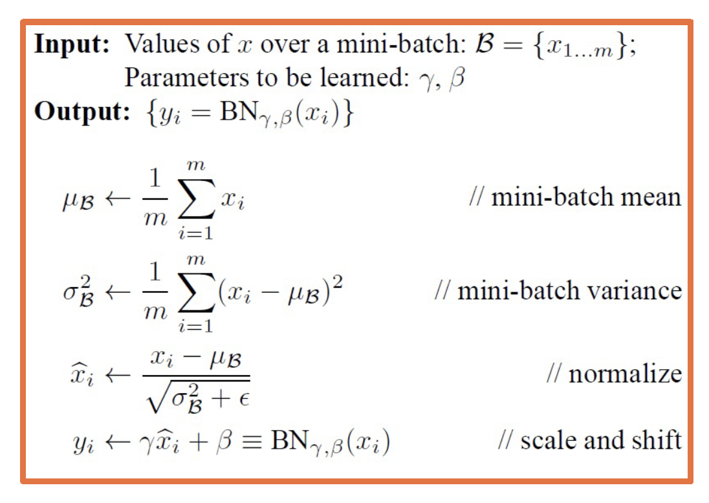

# Optimization of Deep Neural Networks

## Optimization of Deep Neural Networks Overview

### The Power of Deep Learning

Backpropagation, and automatic differentiation, allows us to optimize __any__ function composed of differentiable blocks
- __No need to modify__ the learning algorithm!
- The complexity of the function is only limited by __computation and memory__

### Importance of Depth
A network with two or more hidden layers is often considered a __deep__ model

__Depth is important:__
- Structure the model to represent an inherently compositional world
- Theoretical evidence that it leads to parameter efficiency
- Gentle dimensionality reduction (if done right)

### Designing Depp Neural Networks
There are still many design decisions that must be made:
- Architecture (e.g. reflecting data structure)
- Data considerations (e.g. normalization)
- Training and optimization (e.g. initialization and training to update parameters)
- Machine learning considerations (e.g. how to optimize over parameterized model via methods such as regularization)

### Architectural Considerations
We must design the __neural network architecture:__
- What __modules (layers)__ should we use?
- How should they __be connected together__?
- Can we use our __domain knowledge__ to add architectural biases?

### Example Architectures

### Data Considerations
As in traditional machine learning, __data__ is key:
- Should we __pre-process__ the data?
- Should we __normalize__ it?
- Can we __augment__ our data by adding noise or other perturbations?

### Optimization Considerations
Even given a good neural network architecture, we need a __good optimization algorithm to find good weights__
- What __optimizer__ should we use?
	- Different optimizers make different __weight updates__ depending on the gradients
- How should we __initialize__ the weights?
- What __regularizers__ should we use?
- What __loss function__ is appropriate?

### Machine Learning Considerations
__The practice of machine learning is comples:__ For your particular application you have to __trade off__ all of the considerations together
- Trade-off between __model capacity__ (e.g. measured by # of parameters) and __amount of data__
- Adding __appropriate biases__ based on knowledge of the domain

## Architectural Considerations

### Designing the Architecture
Determining what modules to use, and hot to connect them is part of the __architectural design__
- Guided by the __type of data used__ and its __characteristics__
	- Understanding your data is always the first step!
- __Lots of data types (modalities)__ already have good architectures
	- Start with what others have discovered!
- __The flow of gradients__ is one of the key principles to use when analyzing layers

### Linear and Non-Linear MOdules
- __Combination__ of linear and non-linear layers
- Combination of __only__ linear layers has same representational power as one linear layer
- __Non-linear layers__ are crucial
	- Composition of non-linear layers __enables complex transformation of the data__

### Analysis of Non-Linear Function
Several aspects that we can __analyze__:
- Min/Max
- Correspondence between input & output statistics
- __Gradients__
	- At initializzation (e.g. small values)
	- At extremes
- Computational complexity

### Sigmoid Function
- __Min:__ 0, __Max:__ 1
- Output __always positive__
- Saturates at __both ends__
- __Gradients__
	- Vanishes at both end
	- Always positive
- __Computation: Exponential term__

### Tanh Function
- __Min:__ -1, __Max:__ 1
	- __Centered__
- Saturates at __both ends__
- __Gradients__
	- Vanishes at both end
	- Always positive
- __Still somewhat computationally heavy__

### Rectified Linear Unit
- __Min:__ 0, __Max:__ Infinity
- Output always __positive__
- __No saturation__ on positive end!
- __Gradients__
	- __0__ if __x <= 0__ (dead ReLU)
	- Constant otherwise (does not vanish)
- __Cheap to compute (max)__

### Leaky ReLU
- __Min:__ -Infinity, __Max:__ Infinity
- __Learnable parameter!__
- __No saturation__
- __Gradients__
	- No dead neuron
- __Still cheap to compute__

### Selecting a Non-Linearity
Which __non-linearity__ should you select?
- Unfortunately, __no one activation function is best__ for all applications
- __ReLU__ is most common starting point
	- Sometimes leaky ReLU can make a big difference
- __Sigmoid__ is typically avoided unless clamping to values from [0,1] is needed

## Initialization

### Initializing the Parameters
The parameters of our model must be __initialized to something__
- Initialization is __extermely important!__
	- Determined how __statistics of outputs__ (given inputs) behave
	- Determines how well __gradients flow__ in the begining of training (important)
	- Could __limit use of full capacity__ of the model if done improperly
- Initialization that is __close to a good (local) minima__ will converge faster and to a better solution

### A Poor Initialization
Initializing values to a constant value leads to __a degenerate solution!__
- What happens to the __weight updates?__
- Each node has the same input from previous layers so gradients __will be the same__
- As a results, __all weights will be updated__ to the same exact values

### Gaussian/Normal Initialization
Common approach is __small normally distributed random numbers__
- E.g. *__𝑵 𝝁, 𝝈 𝒘𝒉𝒆𝒓𝒆 𝝁 = 𝟎, 𝝈 = 0.01__*
- __Small weights__ are preferred since no feature/input has prior importance
- Keeps the model within the __linear region of most activation functions__

### Limitation of Small Weights
__Deeper networks (with many layers) are more sensitive to initialization__
- With a deep network, __activations (outputs of nodes) get smaller__
	- Standard deviation reduces significantly
- __Leads to small updates__ - smaller values multiplied by upstream gradients
- Larger initial values lead to _saturation___

  
*From "Understanding the difficulty of training deep feedforward neural networks." AISTATS, 2010.*

### Xavier Initialization
__Ideally, we'd like to maintain the variance at the output to be similar to that of input!__
- This condition leads to a __simple initialization rule__, sampling from uniform distribution
	
- Where *__n_j__* is __fan-in__ (numbers of input nodes) and *__n_j+1__* is __fan-out__ (number of output nodes)

  
*From "Understanding the difficulty of training deep feedforward neural networks." AISTATS, 2010.*

### (Simpler) Xavier and Xavier2 Initialization
In practice, __simpler versions__ perform empirically well:
*__N(0,1) \* sqrt(1/n_j)__*

- This analysis holds for __tanh or similar activations.__
- Similar analysis for __ReLU activations__ leads to:
	*__N(0,1) \* sqrt(1/(n_j/2))__*

*"Delving Deep into Rectifiers:Surpassing Human-Level Performance on ImageNet Classification“, ICCV, 2015.*

### Summary
Key takeaway: __Initialization matters!__
- Determines the __activation__ (output) statistics, and therefore __gradient statistics__
- If gradients are __small__, no learning will occur and no improvements is possible!
- Important to reason about __output/gradient statistics__ and analyze them for new layers and architectures

## Normalization, Preprocessing, and Augmentation

### Importance of Data
In deep learning, __data drives learning__ of features and classifier
- Its __characteristics__ are therefore extremely important
- Always __underatnd your data!__
- __Relationship__ between output statistics, layers such as non-linearities, and gradients is important

### Preprocessing
- Just like initialization, __normalization__ can __improve gradient flow and learning__

Typically __normalization methods__ apply:
- Subtract mean, divide by standard deviation __(most common)__
	- This can be done __per__ dimension
- Whitening, e.g. throught Principle Component Analysis (PCA) __(not common)__

  
*Figure from slides by Fei-Fei Li, Justin Johnson, Serena Yeung, CS 231n*

### Making Normalization a Layer
- We can try to come up with a *layer* that can normalize the data across the neural network
- __Given:__ A mini-batch of data __[*B* x *D*]__ where __*B*__ is batch size
- Compute mean and variance __for each dimension d__

  
*From: Batch Normalization: Accelerating Deep Network Training by Reducing Internal Covariate Shift, Sergey Ioffe, Christian Szegedy*

### Normalizing the Data

### Learnable Scaling and Offset
- We can give the model flexibility throught __learnable parameters *𝜸* (scale) and *𝜷* (shift)__
- Network can learn to __not normalize__ if necessary!
- This layer is called a __Batch Normalization (BN) layer__

### Some Complexities of BN
__During inference,__ stored mean/variances calculated on training set are used
__Sufficient batch sizes__ must be used to get stable per-batch estimates during training
- This is especially an issue when __using multi-GPU or multi-machine training__
- __Use torch.nn.SyncBatchNorm__ to estimate batch statistics in these settings

### Where to Apply BN
Normalization especially important before __non-linearities!__
- Very low/high values (un-normalized/imbalanced data) cause __saturation__

### Generalization of BN
There are __many variations of batch normalization__
- See Convolutional Neural Network lectures for an example

__Resource:__
- __ML Explained - Normalization__

## Optimizers

### Loss Landscape
Deep learning involves __complex, compositional, non-linear functions__

The __loss landscape__ is extremely __non-convex__ as a result

There is __little direct theory__ and a __lot of intuition/rules of thumbs__ instead
- Some insight can be gained via theory for simpler cases (e.g. convex settings)

### Loss Landscape
It used to be thought that __existence of local minima is the main issue__ in optimization

There are other __more impactful issues:__
- Noisy gradient estimates
- Saddle points
- Ill-conditioned loss surface

  
*From: Identifying and attacking the saddle point problem in highdimensional non-convex optimization, Dauphi et al., 2014.*

### Noisy Gradients
- We use a __subset of the data at each iteration__ to calculate the loss (& gradients)
- This is a __unbiased estimator__ but can have high variance
- This results in __noisy steps__ in gradient descent

### Loss Surface Geometry
Several __loss surface geometries__ are difficult for optimization

__Several types of minima:__ Local minima, plataus, saddle points

__Saddle points__ are those where the gradient of orthogonal directions are zero
- But the __disagree__ (it's min for one, max for another)

### Adding Momentum
- Graident descent takes a step in the __steepest direction__ (negative gradient)
- __Intuitive idea:__ Imagine a ball rolling down loss surface, and use __momentum__ to pass flat surfaces
	
- Generalizes SGD __((𝜷 = 𝟎))__

### Accelerated Descent Methods
- Velocity term is an __exponential moving average__ of the gradient
	
- There is a __general class of accelerated gradient method,__ with some theoretical analysis (under assumptions)

### Equivalent Momentum Update

### Nesterov Momentum
__Key idea:__ Rather than combining velocity with current gradient, go along velocity __first__ and then calculate gradient at new point
- We know velocity is probably a __resonable direction__
	

### Nesterov Momentum
Note there are __several equivalent formulations__ across deep learning frameworks!

__Resource:__
- [SGD implementation in pytorch](https://medium.com/the-artificial-impostor/sgd-implementation-in-pytorch-4115bcb9f02c)

### Hessian and Loss Curvature
- Various mathematical ways to __characterize the loss landscape__
- If you liked __Jacobians__... meet the 
	
- Gives us information about the __curvature of the loss surface__

### Condition Number
__Condition number__ is the ratio of the largest and smallest eigenvalue
- Tells us how different the curvature is along different dimensions

If this is high, SGD will make __big steps__ in some dimensions and __small__ steps in other dimension

Second-order optimization methods divide steps by curvature, but expensive to compute

### Per-Parameter Learning Rate
__Idea:__ Have a dynamic learning rate for each weight

Several flavors of __optimization algorithms:__
- RMSProp
- Adagrad
- Adam
- ...

__SGD can achieve similar results__ in many cases but with much more tuning

### Adagrad
__Idea:__ Use gradient statistics to reduce learning rate across iterations
__Denominator:__ Sum up gradients over iterations
Directions with __high curvature will have higher gradients,__ and learning rate will reduce

  
*Duchi, et al., “Adaptive Subgradient Methods for Online Learning and Stochastic Optimization”*

### RMSProp
__Solution:__ Keep a moving average of squared gradients!

Does not saturate the learning rate

### Adam
__Combines ideas__ from above algorithms

__Maintains both first and second moment__ statistics for gradients

__Solution:__ Time-varying bias correction

Typically __𝜷_𝟏 = 0.9, 𝜷_𝟐 = 0.888__

So *v_i hat* will be small number divided by (1-0.9=0.1) resulting in more resonable values (and *G_i hat* larger)

### Behavior of Optimizer
Optiumizers behave differently __depending on landscape__

Different behaviors such as __overshooting, stagnating, etc.__

__Plain SGD+Momentum__ can generalize better than adaptive methods, but requires more tuning
- See Luo et al., Adaptive Gradient Methods with Dynamic Bound of Learning Rate, ICLR 2019

  
*From: https://mlfromscratch.com/optimizers-explained/#/*

## Learning Rate Schedules
First order optimization methods have __learning rates__

Theoretical results rely on __annealed learning rate__

__Several schedules that are typical:__
- Graduate student!
- Step scheduler
- Exponential scheduler
- Cosine scheduler

  
*From: Leslie Smith, “Cyclical Learning Rates for Training Neural Networks”*

## Regularization

### Regularization
Many __standard regularization methods__ still apply!

__Example regularizations:__
- L1/L2 on weights (encourage small values)
- L2: __𝑳 = |𝒚 −𝑾𝒙_𝒊|^2 + 𝝀|𝑾|^2__ (weight decay)
- Elastic L1/L2: __𝒚 − |𝑾𝒙_𝒊|^2𝟐 + 𝜶|𝑾|^2 + 𝜷|𝑾|__

### Preventing Co-Adapted Features

__Problem:__ Network can learn to rely strong on a few features that work really well
- May cause __overfitting__ if not representative of test data

  
*From: Dropout: A Simple Way to Prevent Neural Networks from Overfitting, Srivastava et al.*

### Dropout Regularization 
__An idea:__ For each node, keep its output with probability *p*
- Activations of deactived nodes are essentially zero
Choose whether to mask out a particular node __each iteration__

  
*From: Dropout: A Simple Way to Prevent Neural Networks from Overfitting, Srivastava et al.*

### Dropout Implementation
- In practice, implement with a __mask__ calculated each iteratino
- During testing, no nodes are dropped

  
*From: Dropout: A Simple Way to Prevent Neural Networks from Overfitting, Srivastava et al.*

### Inference with Dropout
- During training, each node has an expected __*p \* fan_in*__ nodes
- During test all nodes are activated
- __Principle:__ Always try to have similar train and test-time input/output distributions!

__Solution:__ During test time, scale outputs (or equivalently weights) by __*p*__
- i.e. __*W_test = pW*__
- Alternative: Saale by __*1/p*__ at train time

### Why Dropout Works
__Interpretation 1:__ The model should not rely too heavily on particular features
- If it does, it has probability __*1 - p*__ of losing that feature in an iteration

__Interpretation 2:__ Training 2^n networks:
- Each configuration is a network
- Most are trained with 1 or 2 mini-batches of data

## Data Augmentation

### Data Augmentation: Motivation
__Data augmentation__ - Performing a range of __transformations__ to the data
- This essentially __"increases"__ your dataset
- Transformations should not change meaning of the data (or label has to be changed as well)

__Simple example: Image Flipping__

### Random Crop
- Take different crops during training
- Can be used during inference too!

  
*Yun et al., CutMix: Regularization Strategy to Train Strong Classifiers with Localizable Features*

### Color Jitter
  
*From https://mxnet.apache.org/versions/1.5.0/tutorials/gluon/data_augmentation.html*

### Geometric Transformations
We can apply __generic affine transformations:__
- Translation
- Rotation
- Scale
- Shear

### Combining Transformations
We can __combine these transformations__ to add even more variety!

  
*From https://mxnet.apache.org/versions/1.5.0/tutorials/gluon/data_augmentation.html*

### Other Variations

__CowMix__
  
*From French et al., “Milking CowMask for Semi-Supervised Image Classification”*

## The Process of Training Neural Networks

## The Process of Training
- Training deep neural networks is an art form!
- Lots of things matter (together) - the key is to find a combination that works
- __Key principle:__ MOnitoring everything to understand what is going on!
	- Loss and accuracy curves
	- Gradient statistics/characteristics
	- Other aspects of computation graph

### Proper Methodology
Always start with __proper methodology!__
- __Not uncommon__ even in published papers to get this wrong

Separate data into: __Training, validation, test set__
- __Do not look__ at test set performance until you have decided on everything (including hyper-parameters)

Use __cross-validation__ to decide on hyper-parameters if amount of data is an issue

### Sanity Checking
Check the bounds of your loss function
- E.g. cross-entropy ranges from __[𝟎,∞]__
- Check initial loss at small random weight values
	- E.g. __-log(p)__ for cross-entropy, where __p=0.5__

Another example: Start without regularzation and make sure loss goes up when added

__Key Principle:__ Simplify the dataset to make sure your model can properly (over)-fit before applying regulariztion

 

### Loss and Not a Number (NaN)

 
__Change in loss indicatres speed of learning:__
- Tiny loss change -> too small of a learning rate
- Loss (and then weights) turn to NaNs -> too high of a learning rate

 

__Other bugs can also cause this, e.g.:__
- Divide by zero
- Forgetting the log!

__In pytorch, use autograd's detect anomalyl to debug__
 

### Overfitting
- Classic machine learning signs of under/overfitting still apply!
	- __Over-fitting:__ Validation loss/accuracy starts to get worse after a while
	- __Under-fitting:__ Validation loss very close to training loss, or both are high
- __Note:__ You can have higher training loss!
	- Validation loss has no regularization
	- Validation loss is typically measured at the end of an epoch

 

### Hyper-Parameter Tuning

Many hyper-parameters to tune!
- Learning rate, weight decay crucial
- Momentum, others more stable
- __Always tune__ hyper-parameters; even a good idea will fail untuned!

Start with coarser serarch:
- E.g. learning rate of {0.1, 0.05, 0.03, 0.01, 0.003, 0.001, 0.0005, 0.0001}
- Perform finer search around good values

 

Automated methods are OK, but intuition (or random) can do well given enough of a tuning budget

### Inter-dependence of Hyperparameters
Note that hyper-parameters and even module selection are __interdependent!__

__Examples:__
- Batch norm and dropout __maybe not be needed together__ (and sometiems the combination is worse)
- The learning rate should be __changed proportionally to batch size__ - increase the learning rate for larger batch sizes
	- __One interpretation:__ Gradients are more reliable/smoother

### Relationship Between Loss and Other Metrics
Note that we are optimizing a __loss function__

What we actually care about is __typically different metrics that we can't differentiate:__
- Accuracy
- Precision/recall
- Other specialized metrics

__The relationship between the two can bre complex!__

  
*From https://en.wikipedia.org/wiki/Precision_and_recall*

### Simple Example: Cross-Entropy and Accuracy
- __Example:__ Croos entropy loss
	__*L = -log(P(Y = y_i|X = x_i))*__
- __Accuracy__ is measured based on:
	__*argmax_i(P(Y = y_i | X = x_i))*__

- Since the correct class score only has to be slightly higher, we can have __flat loss curves but increasing accuracy!__

 

### Example: Precision/Recall or ROC Curves
- __TPR/FPR curves__ represent the inherent tradeoff between number of positive predictions and correctness of predictions

	- Receiver operating characteristic (ROC) curves similar, plot precision/recall instead
- __Definitions__
	- True Positive Rate: __*TPR*__ = *tp/(tp+fn)*
	- False Positive Rate: __*FPR*__ = *fp/(fp_tn)*
	- __*Accuracy*__ = *(tp+tn) / (tp+tn+fp_fn)*

  
*From https://en.wikipedia.org/wiki/Receiver_operating_characteristic*

- __Precision/Recall curves__ represent the inherent tradeoff between number of positive predictions and correctness of predictions
- We can obtain a __curve__ by varying the (probability) threshold:
	- __Area under the curve (AUC)__ common single-number metric to summarize
- Mapping between this and loss is __not simple!__

### Resource:

- [A disciplined approach to neural network hyper-parameters: Part 1 -- learning rate, batch size, momentum, and weight decay, Leslie N. Smith](https://arxiv.org/abs/1803.09820)

