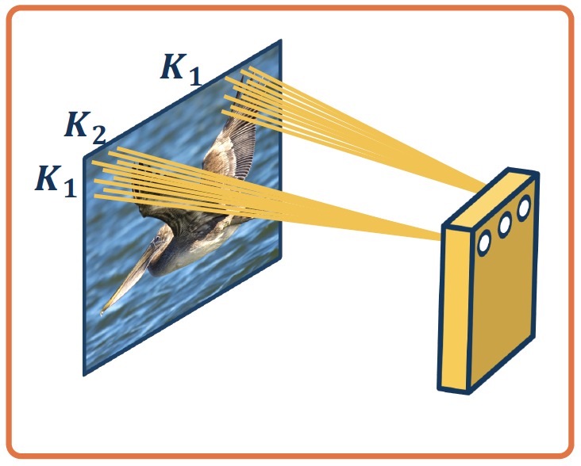

# Lesson 5: Convolution and Pooling Layers

## Convolution Layers

### The Power of Deep Learning
Backpropagation, and automatic differentiation, allows us to optimize any function composed of differentiable blocks
- __No need to modify__ the learning algorithm!
- The complexity of the function is only limited by __computation and memory__

### Limitation of Linear Lahyers

The connectivity in linear layers __doesn't always make sense__.
- __How many parameters?__: *__M\*N__*
- Hundreds of millions of parameters __for just one layer__
- __More parameters => More data needed__
- Is this necessary?

### Locality of Features
**Image features are spatially localized!**
- Smaller features repeated across the image
	- Edges
	- Color
	- Motifs (corner, etc.)
- No reason to believe one feature tends to appear in one location v.s. another (stationarity)
- Can we induce a *bias* in the design of a neural network layer to reflect this?

### Idea 1: receptive Fields

*Do we need to learn location specific features?*

Each node only received input from *__K_1 x K_2__* window (image patch)
- region from which a node receives input from is called its **receptive field**

**Advantages**
- Reduced parameters to (*__K_1 x K_2 + 1 \* N__*) where *__N__* is the number of output nodes
- Explicitly maintain spatical information

### Idea 2: Shared Weights

Nodes in different locations can __share__ features
- No reason to think same feature (e.g. edge pattern) can't appear elsewhere
- Use same weights/parameters in computation graph __(shared weights)__

__Advantages:__
- Reduced parameters to *__K_1 x K_2 + 1__*
- Explicitly maintain spatial information

### Idea 3: Learn Many Features

We can learn __many__ such features for this one layer
- weights are __not__ shared across different feature extractors
- __Parameters__: *__(K1 x K_2 + 1)\*M__* where *__M__* is the number of features we want ot learn

### Convolution

*Visual comparison of convolution and cross-correlation.*

This operation is __extremely common__ in electrical/computer engineering!

In mathematics and, in particular, functional analysis, __convolution__ is a mathematical operation on two functions *f* and *g* producing a third function that is typically viewed as a modified version of one of the original functions, giving the area overlap between the two functions as a function of the amount that one of the original functions is translated.

Convoluation is similar to __cross-correlation__.

It has __applications__ that include probability, statistics, computer vision, image and signal processing, electrical engineering, and differential equations.

### 2D Discrete Convolution

We will make this convolution operation __a layer__ in the neural network
- Initialize kernel values randomly and optimize them!
- There are our parameters (plus a bias term per filter)

### The Intuitive Explanation

### Mathematics of Discrete 2D Convolution

### Centering Around the Kerne;

### Convolution and Cross-Correlation
__As we have seen:__
- __Convolution:__ Start at end of kernel and move back
- __Cross-correlation:__ Start in the beginning of kernel and move forward (same as for image)

An __intuitive interpretation__ of the relationship:
- Take the kernel, and rotate 180 degrees along center (sometimes referred to as "flip")
- Perform cross-correlation
- (Just dot-product filter with image!)

### Cross-Correlation

### Why Bother with Convolutions?
Convolutions are just __simple linear operations__

__Why bother__ with this and not just say it's a linear layer with small receptive field?
- There is __duality__ between them during backpropagation
- Convolutions have __various mathematical properties__ people care about
- This is __historically__ how it was inspired

## Input & Output Sizes

### Convolution Layer Hyper-Parameters
- __in_channels__ *(int)* - Number of channels in the input image
- __out_channels__ *(int)* - Number of channels produced by the convolution
- __kernel_size__ *(int or tuple, optional)* - Size of the convolving kernel
- __stride__ *(int or tuple, optional)* - Stride of the convolution. Default: 1
- __padding__ *(int or tuple, optional)* - Zero-padding added to both slides of the input. Default: 0
- __padding_mode__ *(string, optional)* - 'zeros', 'reflect', 'replicate' or 'circular'. Default: 'zero'
*From: https://pytorch.org/docs/stable/generated/torch.nn.Conv2d.html#torch.nn.Conv2d*

### Valid Convolution

__Output size__ of vanilla vonvolution operation is *__(H - k_1 + 1) x (W - k_2 + 1)__*
- This is called a __"valide" convolution__ and only applies kernel within image

### Adding Padding

We can __pad the images__ to make the output the same size:
- Zeros, mirrored image, etc.
- Note padding often refers to pixels added to __one size (P = 1 here)__

### Stride

We can move the filter along the image using larger steps __(stride)__
- This can protentially result in __loss of information__
- Can be used for __dimentionality reduction__ (not recommended)

### Invalide Stride

Stide can result in __skipped pixels__, e.g. stride of 3 for 5x5 input

### Multi-Channel Inputs

We have shown inputs as a __one-channel image__ but in reality they have three channels (red, green, blue)
- In such cases, we have __3-channel kernels__!

### Operation of Multi-Channel Inputs
We have shown inputs as a __one-channel image__ but in reality they have three channels (red, green, blue)
- In such cases, we have __3-channel kernels__!

Similar to before, we perform __element-wise multiplication__ between kernel and image patch, summing them up __(dot product)__
- Except with *__k_1 \* k_2 \* 3__* values

### Multiple Kernels - Number of Parameters

We can have __multiple kernels per layer__
- Number of channels in output is equal to number of kernels
- Number of parameters with N filters is: *__N \* (k_1 \* k_2 \* 3 + 1)__*
	- Example: *__k_1 = 3, k_2 = 3, N = 4, input channels = 3__*, then __(3 \* 3 \* 3 + 1) \* 4 = 112__

### Vectorization
Just as before, in practice we can __vectorize__ this operation

- __Step 1:__ Lay out image patches in vector form
	

- __Step 2:__ Multiple patches by kernels
	

## Pooling Layers
- __Dimensionality reduction__ is an important aspect of machine learning
- Can we make a layer to __explicitly down-sample__ image or feature maps?
- __Yes!__ We call one class of these operations __pooling__ operations

### Max Pooling
__Example:__ Max pooling
- Stride window across image but perform per-patch __max operation__

__Not restricted to max;__ can use any differentiable function
- Not very common in practice

### Combining Convolution & Pooling Layers
Since the **output** of convolution and pooling layers are __(multi-channel) images__, we can sequence them just as any other layer

### Invariance
This combination adds some __invariance__ to translation of the features
- If feature (such as beak) translated a little bit, output values still __remain the same__

### Invariance v.s. Equivariance
Convolution by itself has the property of __equivariance__
- If feature (such as beak) translated a little bit, ouput values __move by the same translation__

