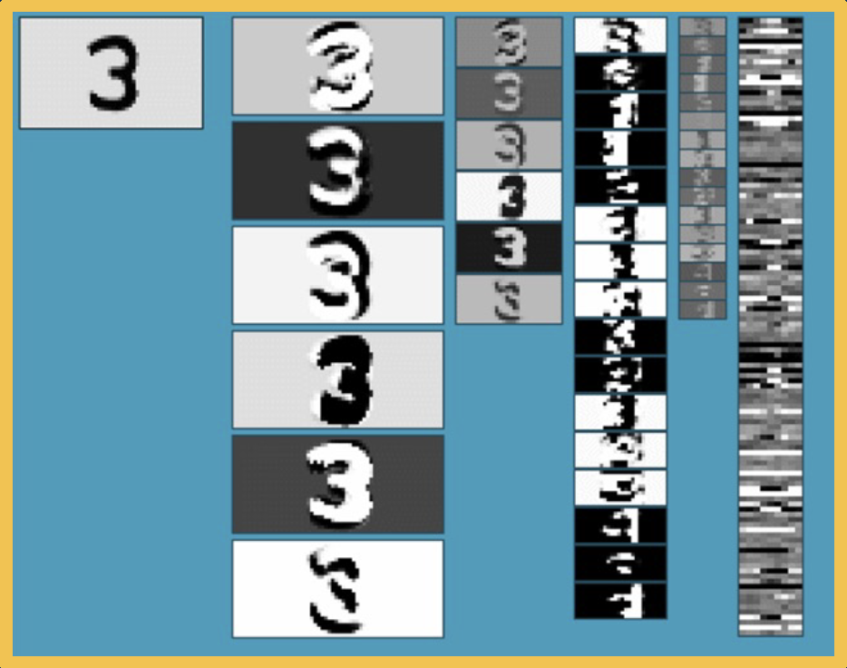

# Lesson 6: Convolutional Neural Network Architectures

## Backwards Pass for Convolution Layer

### Backwards Pass for Conv Layers
It is intructive to calculate __the backwards pass__ of a convolution layer
- Similar to fuly connected layer, will be __simple vecgtorized linear algebra operation!__
- We will see a __duality__ between cross-correlation and convolution

### Recap: Cross-Correlation

### Iterators

__Some simplification:__ 1 channel input, 1 kernel (channel output), padding (here 2 pixels on right/bottom) to make output the same size

### Gradient Terms and Notation

### Backpropagation Chain Rule

## Gradient for Convolution Layer

### What a Kernel Pixel Affects at Output

What does this weight affect at the output?
- Everything!

### Chain Rule over all Output Pixels

Need to incorporate all upstream gradients:
- {𝝏L/𝝏y(0,0), 𝝏L/𝝏y(0,1), ... 𝝏L/𝝏y(H,W)}

### Forward and Backward Duality

### What an Input Pixel Affects at Output

- What does this input pixel affect at the output?
	- Neighborhood around it (where part of the kernel touches it)

- Gradient for input (to pass to prior layer)
	- 𝝏L/𝝏x = 𝝏L/𝝏y 𝝏y/𝝏x
	- Calculate one pixel at a time: 𝝏L/𝝏x(r', c')

### Extents of Kernel Touching the Pixel

### Extents at the Output

### Summing Gradient Contributions

### Calculating the Gradient

### Backwards is Convolution

## Simple Convolutional Neural Networks

### Combining Convolution & Pooling Layers

Since the __output__ of convolution and pooling layers are __(multi-channel) images__, we can sequence them just as any other layer.

### Alternating Convolution and Pooling

### Adding a Fullyl Connected Layer

### Receptive Fields

Increasing receptive field for a particular pixel deep inside the network

### Typical Depiction of CNNs

### LeNet Architecture

*These architectures have existed __since 1980s__*

### Handwriting Recognition

### Translation Equivariance (Conv Layers) & Invariance (Output)

- Translation equivariance: 
	- When you move the input in particular ways across the image, the feature also moves. 
	- That is the feature detection in the output maps also move in the same way as you move the input.
- Translation Invariance:
	- Even if you move or translate the digit across the image, it will still output that it's a four.
- Rotation invariance
- Scale invariance

## Advanced Convolutional Networks

### The Importance of Benchmarks

__IMAGENET (2012)__: 
- Over 1.2 million labelled examples - 1000 categories
- After Deep Learning was employed for IMAGENET, it out performed existing methods (e.g. manual feature extraction, SVM etc.) 

### AlexNet

__Architecture__

__Layers and Key Aspects__
- ReLU instead of sigmoid or tanh (__First!__)
- Specialized normalization layers (Relic)
- PCA-based data augmentation (Relic)
- Dropout (__First!__)
- Ensembling

### VGG

__Architecture__

- Most memory usage in convolution layers
	- Storing activation obtained during forward pass for calculating gradients during back prop
- Most parameters in FC layers

__Key Characteristics__
- Repeated application of:
	- 3x3 conv (stride of 1, padding of 1)
	- 2x2 max pooling (stride 2)
- Very large number of parameters

### Inception 

__Architecture__

__Module__: Key idea - Repeated blocks and multi-scale features

### The Challenge of Depth

### Residual Blocks and Skip Connections

__Key idea:__ Allow information from a layer to propagate to any future layer (forward)
- *Same is true for gradients!*

### Evolving Architectures and AutoML

__Several ways to *learn* architectures:__
- Evolutionary learning and reinforcement learning
- Prune over-parameterized networks
- Learning of __repeated blocks__ (typical)

### Computational Complexity

*How can we get the same performance by reducing the number of parameters?*

## Transfer Learning & Generalization

__Sources of Error:__
- Modeling Error
	- Given a particular NN, your actual model that represents the real world may not be in that space. (e.g. there's no set of weights that model the real world.)
- Estimation Error (Generalization)
	- Even if we do find the best hypothesis, this best set of weights or parameters of our neural network that minimizes the training error, that doesn't mean that you will be able to generalize to the testing set. (e.g. overfitting)
- Optimization Error
	- Even if the NN can perfectly model the world, your optimization algorithm may not be able to find the good weights that model that function.

### Transfer Learning - Traning on Large Dataset

__What if we don't have enough data?__
- __Step 1:__ Train on large-scale dataset
- __Step 2:__ Take your custom data and __initialize__ the network with weights trained in Step 1
- __Step 3:__ (Continue to) train on new dataset
	- __Finetune:__ Update all parameters
	- __Freeze__ feature layer: Update only last layer weights (used when not enough data)

### Surprising Effectiveness of Transfer Learning

__This works extremely well!__ It was surprising upon discovery.
- Features learned for 1000 object categories will work well for 1001st!
- Generalizes even across tasks (classification to object detection)

### Learning with Less Labels

__But it doesn't always work that well!__
- If the __source__ dataset you train on is very different from the __target__ dataset, transfer learning is not as effective
- If you have enough data for the target domain, it just results in faster convergence
	- See He et. al., "Rethinking ImageNet Pre-training"

### Effectiveness of More Data

