# Lesson 9: Advanced Computer Vision Architectures

## Image Segmentation Networks

### Computer Vision Tasks

- Classification: Class distribution per image
- Object Detection: List of bounding boxes with class distribution per box
- Semantic Segmentation: Class distribution per pixel
- Instance Segmentation: Class distribution per pixel with unique ID

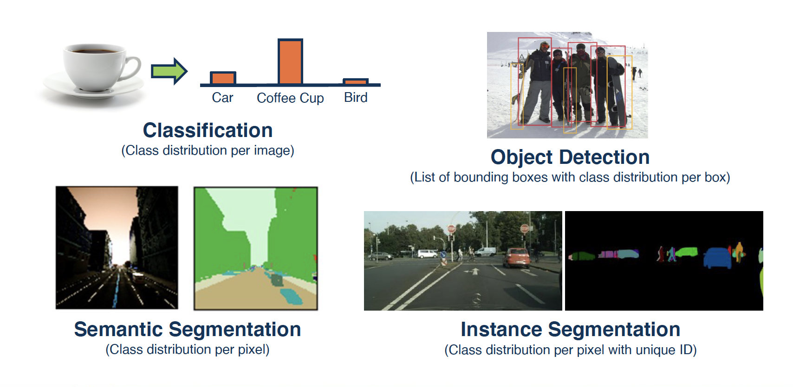

### Segmentation Tasks
__Given an image, output another image__
- Each output contains class distribution per pixel
- More generally an image-to-image problem

__Input & Output__

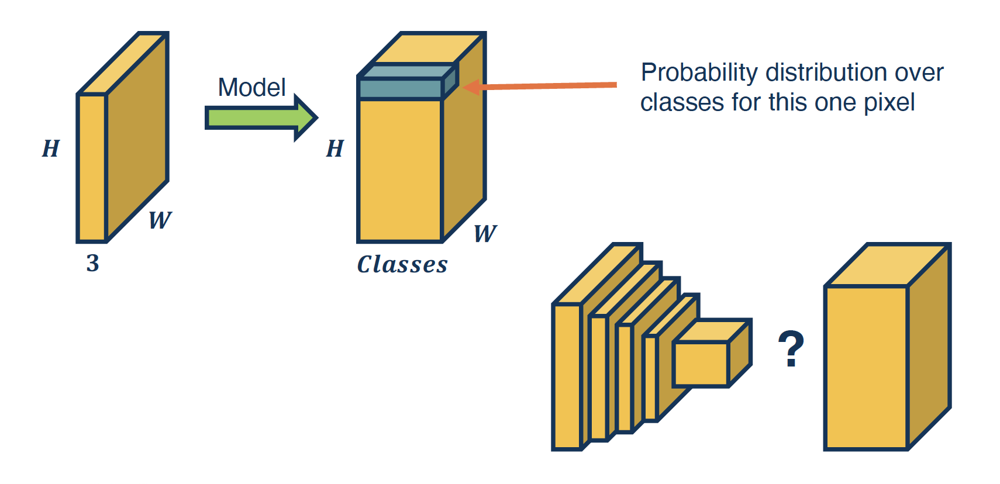

### Idea 1: Fully-Convolutional Network (get rid of fully connected layers)
- Fully connected layers no longer explicitly retain spatial information (though the network can still learn to do so)
- __Idea: Convert fully connected layer to convolution!__
	- __Each kernel has the size of entire input! (output is 1 scalar)__
		- This is equivalent to Wx+b!
		- We havre one kernel per output node
	- *Can re-shape fully connected nodes into input size*
	- Can be seen as a convolution operation: the kernel be the exact size of the input
	- Useful for segmentation: allow us to be no longer dependent on a particular input size

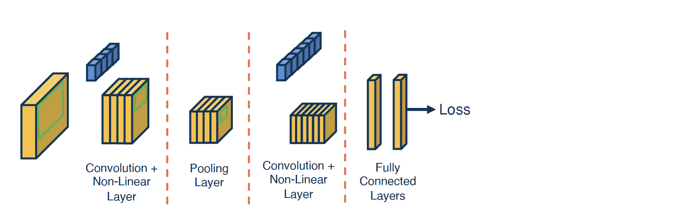

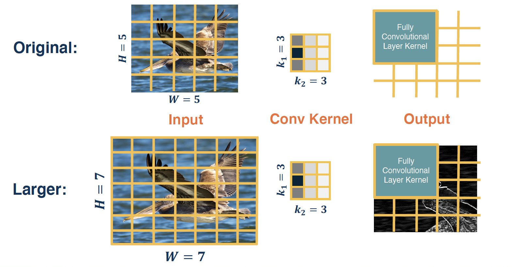

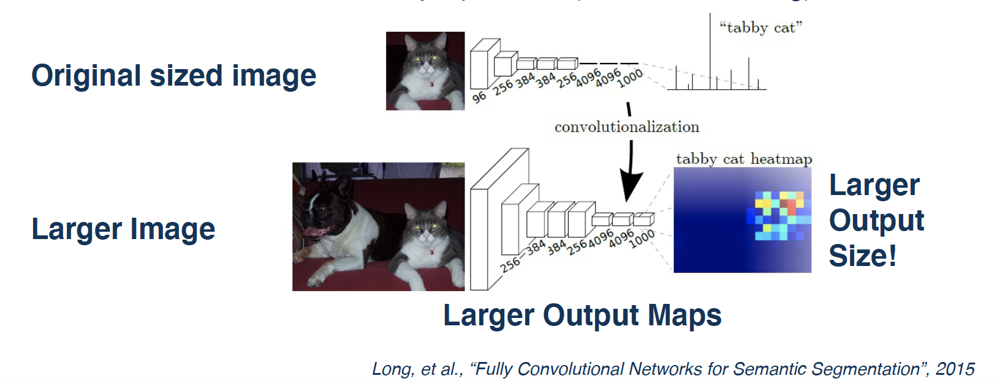

__Inputting Larger Images__
- __Why does this matter?__
	- We can stride the "fully connected" classifier across larger inputs!
	- Convolutions work on arbitrary input sizes (because of striding)

*More info in Q&A: __How does it work if you would like to use Fully-Convolutional Network for image segmentation?__*

### Idea 2: “De”Convolution and UnPooling

__We can develop learnable or non-learnable upsampling layers!__

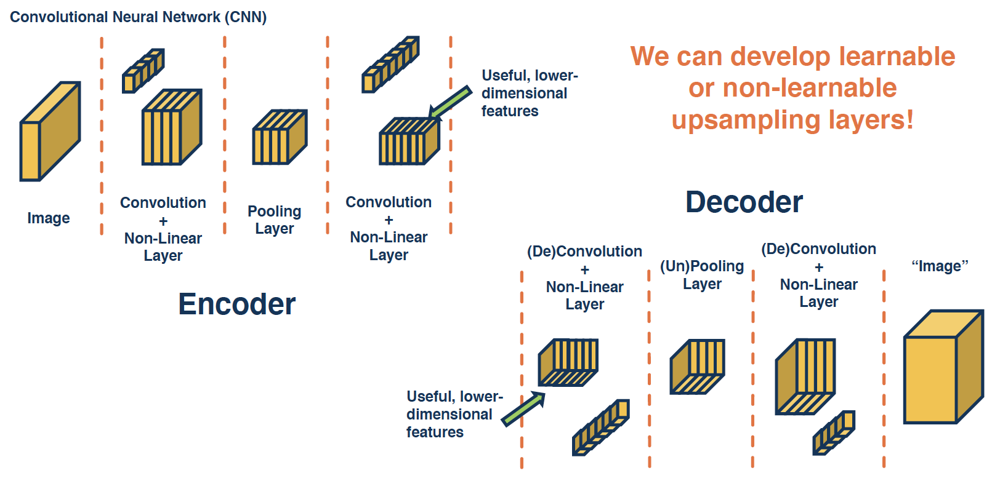

*More info in Q&A: __How does it work if you would like to use Fully-Convolutional Network for image segmentation?__*

__Max Unpooling__
- Stide window across image but perform per-patch __max operation__
- __Idea__: Remember max elements in encoder! Copy value from equivalent position, rest are zeros

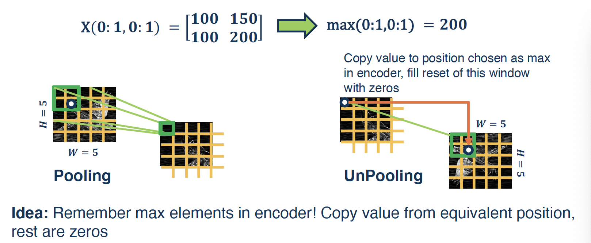

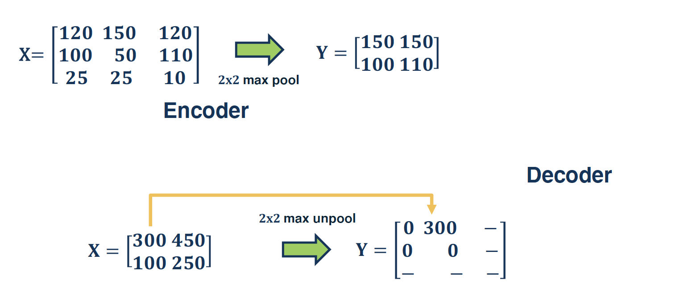

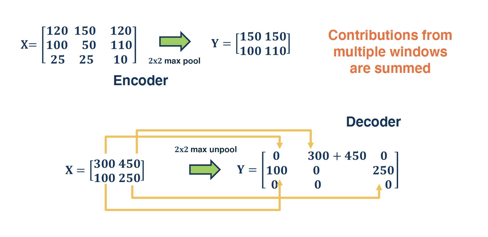

*More info in Q&A: __How does Max Unpooling work?__*

__Symmetry in Encoder/Decoder__
- We pull max indices from corresponding layers (requires symmetry in encoder/decoder)

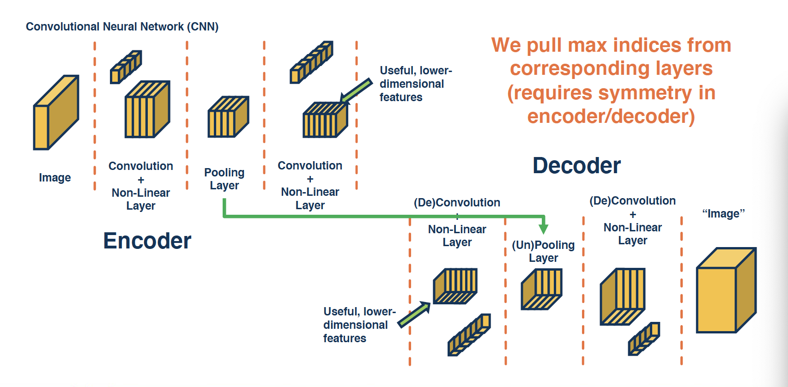

*More info in Q&A: __What is an encoder-decoder? Provide references.__*

__"De"Convolution (Transposed Convolution)__
- How can we upsample using convolutions and learnable kernel?

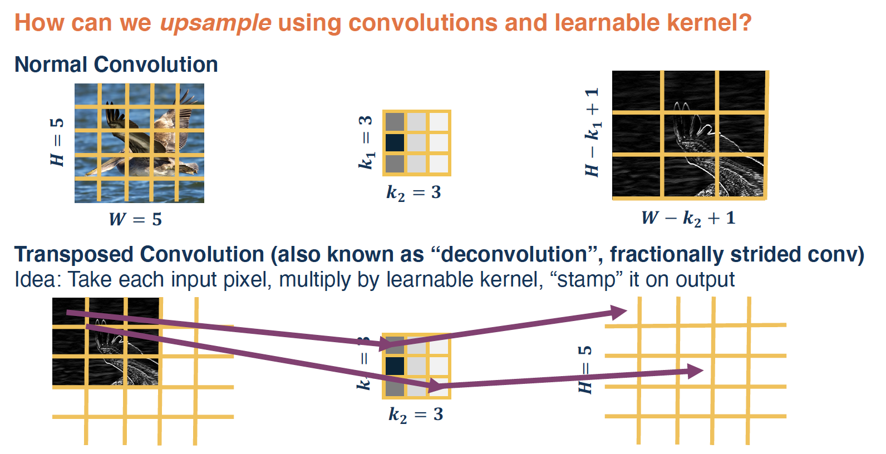

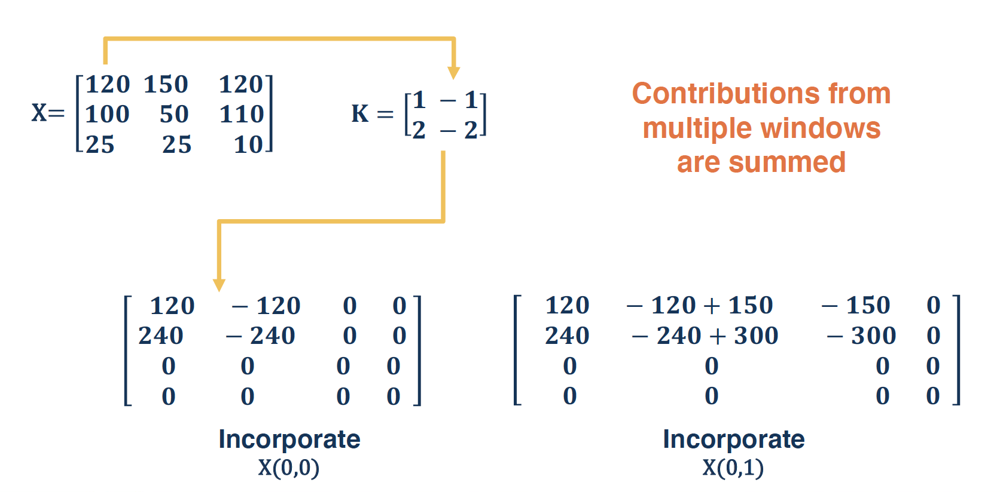  
*Transposed Convolution Example*

*More info in Q&A: __What are advantages and disadvantages of deconvolutional versus max unpooling? Provide references.__*

__Symmetry in Encoder/Decoder__
- We can either learn the kernels, or take corresponding encoder kernel and rotate 180 degrees (no decoder learning)

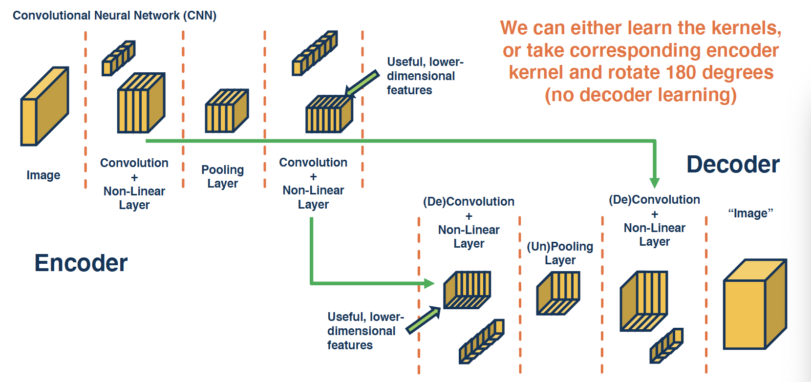

__Transfer Learning__
- We can start with a pre-trained trunk/backbone (e.g. network pretrained on ImageNet)!

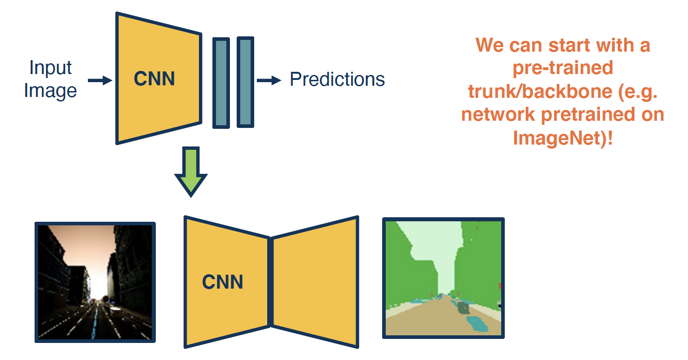

__U-Net__
- You can have skip connections to bypass bottleneck!

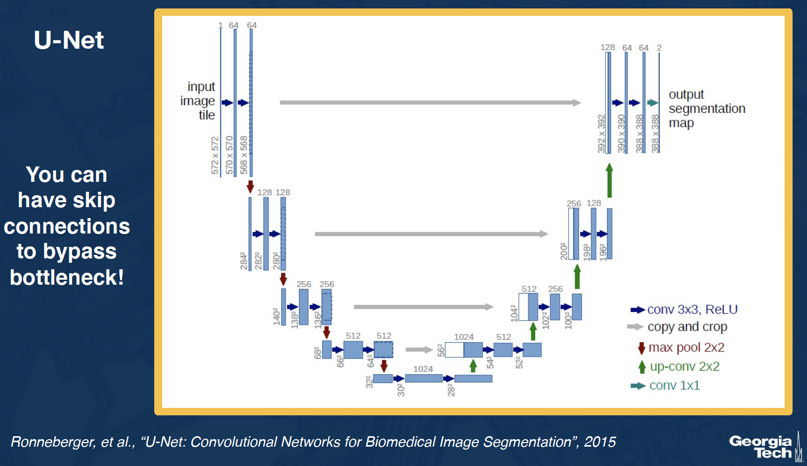

*More info in Q&A: __What are some pros and cons of U-Net? Provide references.__*

### Summary
- Various ways to get __image-like outputs__, for example to predict segmentations of input images
- Fully convolutional layers essentially apply the striding idea to the output classifiers, supporting arbitrary input sizes
	- (without output size requiring particular input size)
- We can have various upsampling layers that actually increase the size
- Encoder/decoder architectures are popular ways to leverage these to perform general image-to-image tasks

### References and Links:
- Long, et al., “Fully Convolutional Networks for Semantic Segmentation”, 2015
- Ronneberger, et al., “U-Net: Convolutional Networks for Biomedical Image Segmentation”, 2015

## Single-Stage Object Detection

### Object Detection Tasks

__Given an image, output a list of bounding boxes with probability distribution over classes per box__
- Problems:
	- Variable number of boxes!
	- Need to determine cadidate regions (position and scale) first

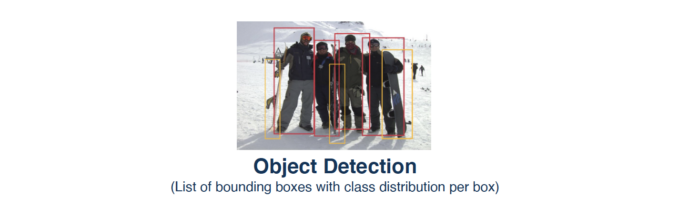

__We can use the same idea of fully-convolutional networks__
- Use ImageNet pre-trained model as backgbone (e.g. taking in 224x224 image)
- Feed in larger image and get classifications for different windows in image

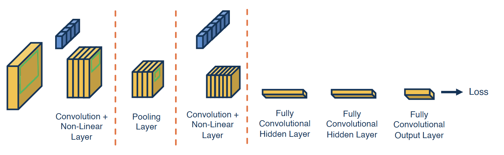

__We can have a multi-headed architecture__
- One part predicting distribution over class labels (classification)
- One part predicting a bounding box for each image region (regression)
	- Refinement to fit the object better (outputs 4 numbers)
- Both heads __share features__! Jointluy optimized (summing gradients)

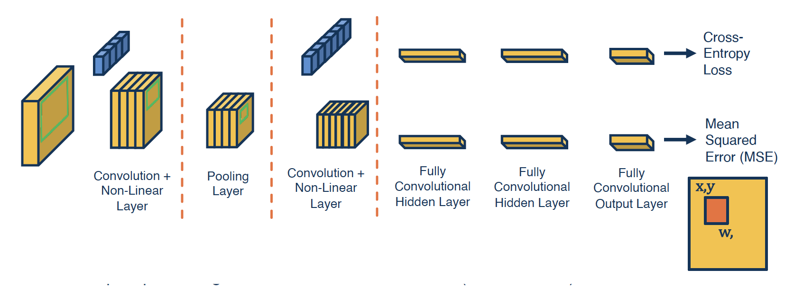

Can also do this at __multiple scales__ to result in a large number of detections
- Various tricks used to increase the resolution (decrease subsampling ratio)
- Redundant boxes are combined through __Non-Maximal Suppression (NMS)__

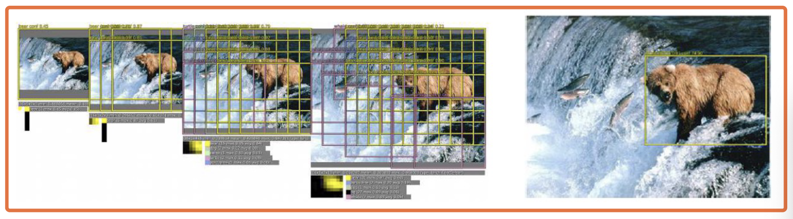

### Single-Shot Detector (SSD)

Single-shot detectors use a similar idea of __grids__ as anchors, with different scales and aspect ratios around them
- Various tricks used to increase the resolution (decrease subsampling ratio)

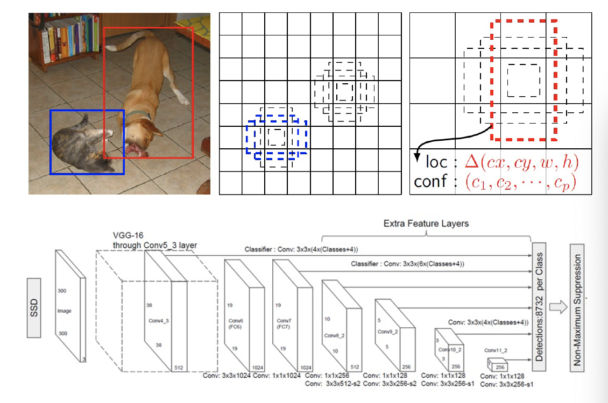  
*Liu, et al., “SSD: Single Shot MultiBox Detector”, 2015*

__You Only Look Once (YOLO)__
- __Similar network architecture but single-scale__ (and hence faster for same size)

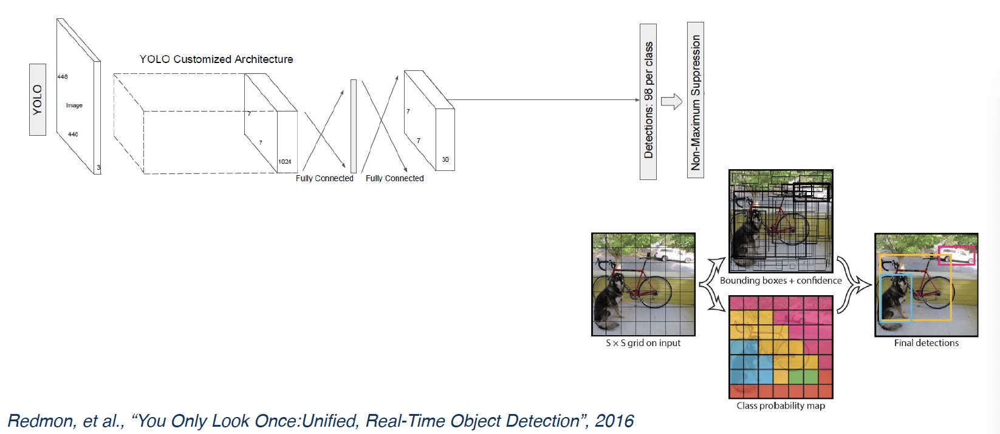

### Datasets

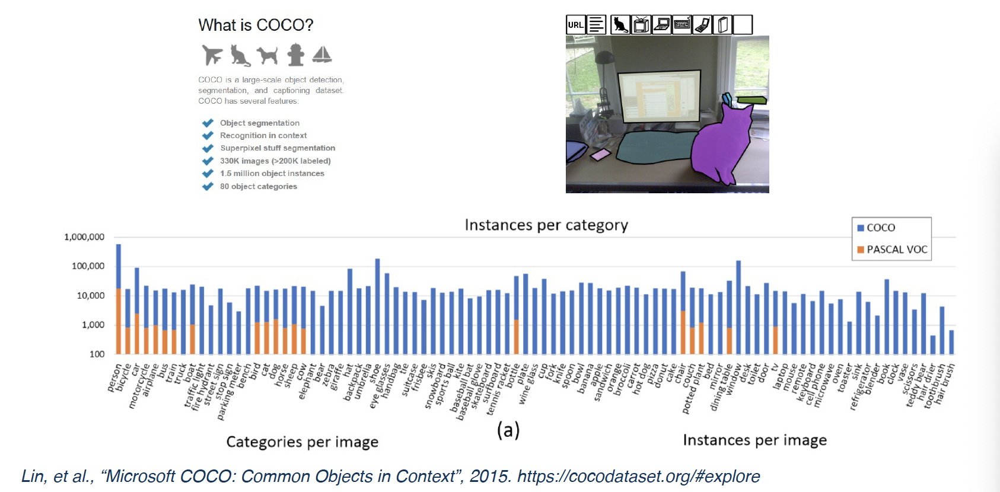

*More info in Q&A: __What is microsoft COCO dataset?__*

### Evaluation - Mean Average Precision (mAP)

*Given Ground Truth & Detection*
1. For each bounding box, calculate intersection over union (IoU)
2. Keep only those with IoU > threshold (e.g. 0.5)
3. Calculate precision/recall curve across classification probability threhold
4. Calculate __average precision (AP)__ over recall of [0, 0.1, 0.2, ..., 1.0]
5. Average over all categories to get mean Average Precision (mAP)

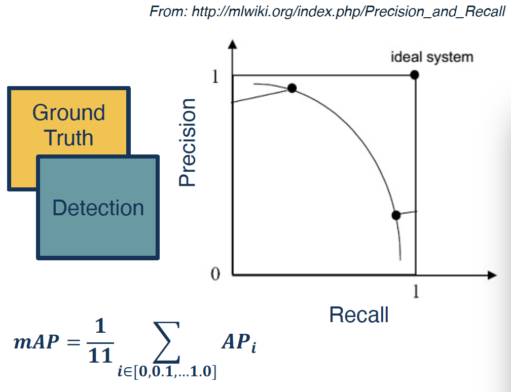

__Results__

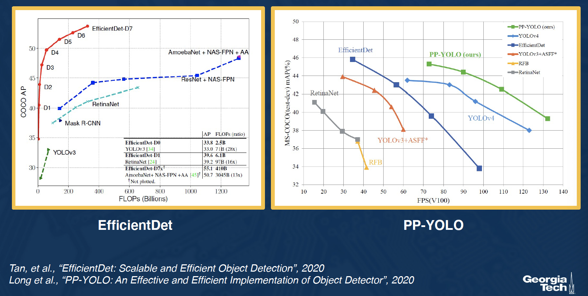

### References and Links:
- Sermanet, et al., “OverFeat: Integrated Recognition, Localization and Detection using Convolutional Networks”, 2013
- Liu, et al., “SSD: Single Shot MultiBox Detector”, 2015
- Redmon, et al., “You Only Look Once:Unified, Real-Time Object Detection”, 2016
- Lin, et al., “Microsoft COCO: Common Objects in Context”, 2015. https://cocodataset.org/#explore
- Tan, et al., “EfficientDet: Scalable and Efficient Object Detection”, 2020
- Long et al., “PP-YOLO: An Effective and Efficient Implementation of Object Detector”, 2020

## Two-Stage Object Detectors

### R-CNN

Instead of making dense predictions across an image, we can decompose the problem:
- Find regions of interest (ROIs) with object-like things
- Classifier those regions (and refine their bounding boxes)

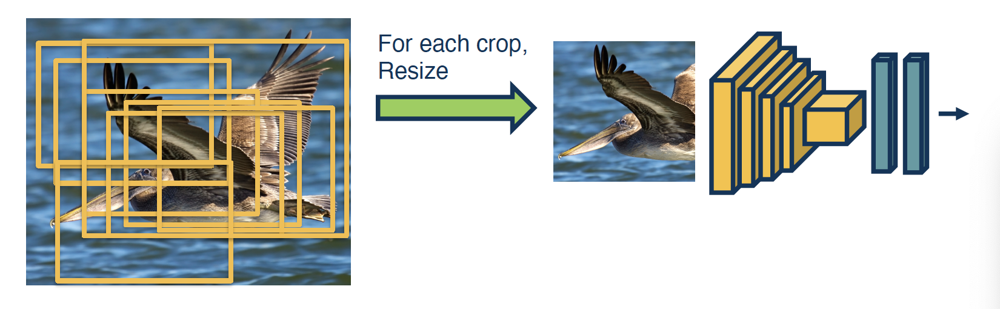

*More info in Q&A: __What is R-CNN? Provide references.__*

### Extracting Region Proposal

We can use __unsupervised (non-learned!) algorithms__ for finding candidates

__Downsides:__
- Takes 1+ second per image
- Regurn thousands of (mostly background) boxes

__Resize each candidate__ to full input size and classify

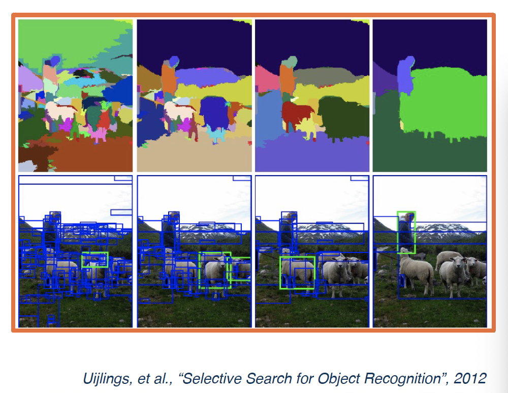

### Inefficiency of R-CNN

__Computation for convolutions are re-done for each image patch, even if overlapping!__

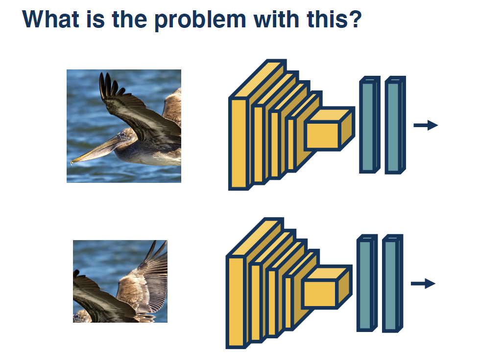

*More info in Q&A: __Compare the algorithm of R-CNN, Fast R-CNN and Faster R-CNN. Provide references.__*

### Fast R-CNN

__Idea: Reuse__ computation by finding regions in __feature maps__
- Feature extraction only done once per image now!
- Problem: Variable input size to FC layers (different feature map sizes)

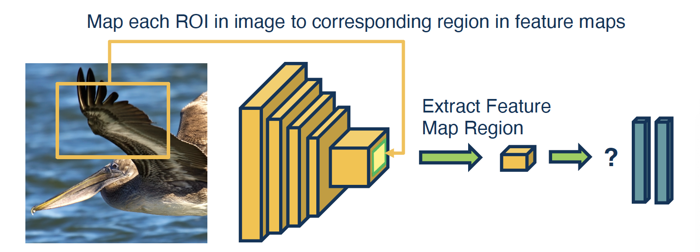

### ROI Pooling

Given an arbitrarily-size feature map, we can use __pooling__ across a grid (ROI Pooling Layer) to convert to fixed-sized representation

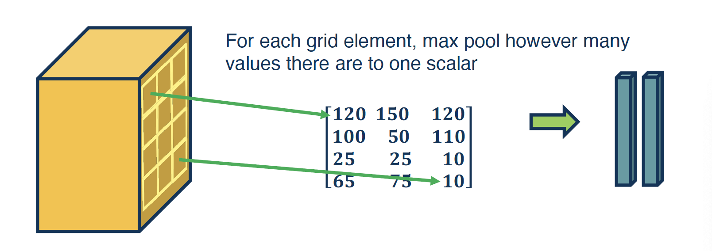

*More info in Q&A: __How does ROI pooling work? Provide references.__*

__Application in Fast R-CNN__
- We can now train this model __end-to-end__ (i.e. backpropagate throught entire model including ROI Pooling)!

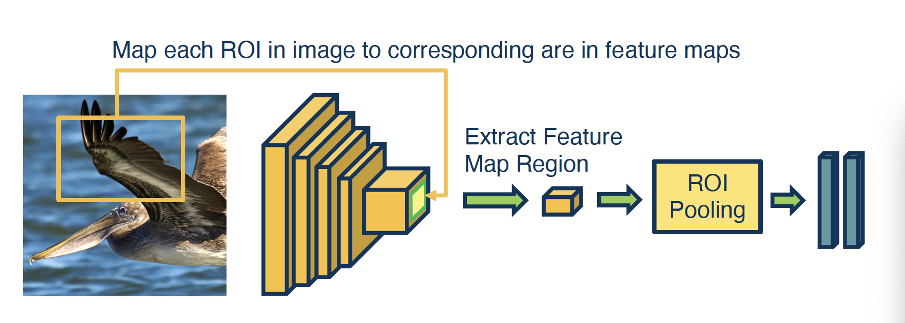

### Faster R-CNN

__Idea__: Why not have the neural network *also* generate the proposals?
	- Region Proposal Network (RPN) uses same features!
- Outputs __*objectness score*__ and bounding box
- Top k selected for classification
- Note some parts (gradient w.r.t. bounding box coordinates) not differentiable so some complexity in implementation

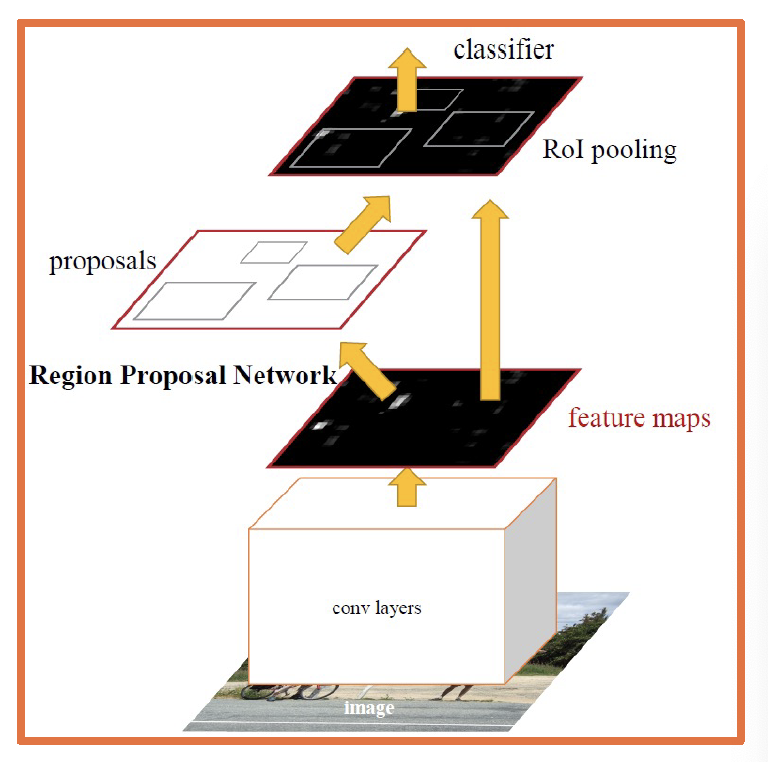  
*Ren, et al., “Faster R-CNN: Towards Real-Time Object Detection with Region Proposal Networks”, 2016*

__RPN__ also uses notion of __anchors in a grid__
	- Boxes of various sizes and scales classified with objectness score and refined bounding boxes refined 
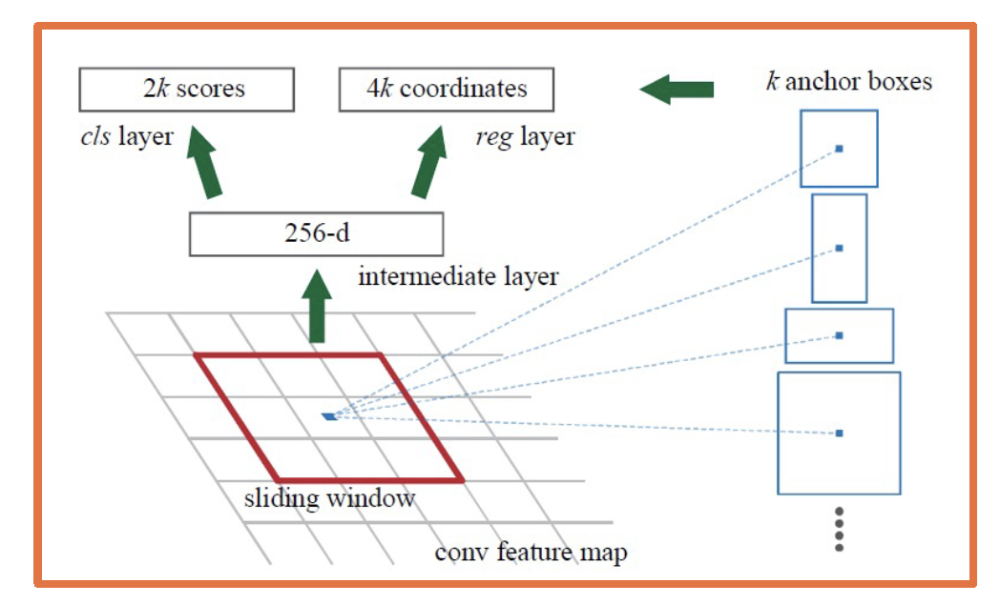  
*Ren, et al., “Faster R-CNN: Towards Real-Time Object Detection with Region Proposal Networks”, 2016*

### Mask R-CNN

Many new advancements have been made

For example, combining detection and segmentation
- Extract forground (object) mask per bounding box

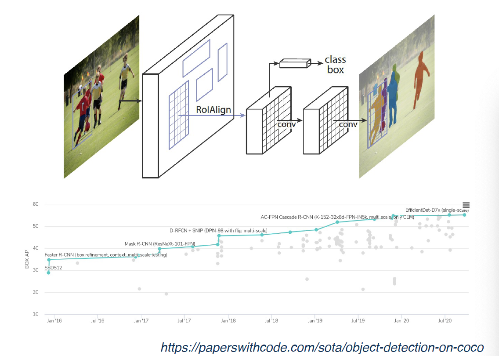  
*He, et al., “Mask R-CNN”, 2018*

### Summary
- Two-stage object detection methods decompose the problem into first finding object-like regions, then classifying them
	- At both steps, bouding boxes are refined through regression
- These methods are slower but more accurate than single-stage methods (YOLO/SSD) though the landscape is changing fast!
- Transfer learning can use pre-trained backbones with newer architectures (ResNet, etc.) as they come along

*More info in Q&A: __What is the current state of the art object detection neural network algorithm? And what are the major inventions associated? Provide references.__*

### References and Links:
- Girshick, et al., “Rich feature hierarchies for accurate object detection and semantic segmentation”, 2014
- Uijlings, et al., “Selective Search for Object Recognition”, 2012
- Girshick, “Fast R-CNN”, 2015
- Ren, et al., “Faster R-CNN: Towards Real-Time Object Detection with Region Proposal Networks”, 2016
- https://paperswithcode.com/sota/object-detection-on-coco 
- He, et al., “Mask R-CNN”, 2018

