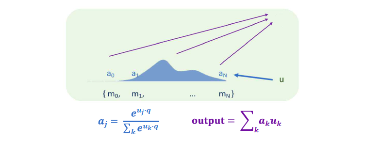

# Module 3: Structured Neural Representations

## The Space of Architectures

## Recurrent Neural Networks

## Enter the Transformer

Transformer [Vaswani et. al. 2017] is a multi-layer attention model that is currently state of the art in most language tasks (and in many other things!)

Has superior performance compared to previous attention based architecture via
- Multi-query hidden-state propagation ("self-attention")
- __Multi-head attention__
- Residual connections, LayerNorm

*More info in Q&A: __Summarize Vaswani et. al. 2017 paper about Transformer...__*

## Sequence Modeling

## Example Application: NLP

## Modeling Language as a Sequence

## Word Embeddings

__Word2vec: the Skip-gram model__
- The idea: use words to __predict__ their context words
- Context: a fixed window of size __*2m*__

## Graph Embeddings

__Embedding:__ A learned map from entities to vectors of numbers that encodes similarity
- Word embeddings: word -> vector
- Graph embeddings: node -> vector

__Graph Embedding:__ Optimize the objective that __connected nodes have more similar embeddings__ than unconnected nodes via gradient descent.

## Application: VideoSpace

## Machine Translation

## Attention in Natural Language PRocessing

__Alignment in machine translation:__ for each word in the target, get a distribution over words in the source [Brown et. al. 1993], (lots more)

## Sequence-to-Sequence Model

## Cross-Lingual Masked Language Modeling

*More info in Q&A: __What is Cross-Lingual Masked Language Modeling? ...__*

## Beam Search
- Search exponential space in linear time
- Beam size __*k*__ determines "width" of search
- At each step, extend each of __*k*__ elements by one token
- Top __*k*__ overall then become the hypotheses for next step

*More info in Q&A: __What is Cross-Lingual Masked Language Modeling? ...__*

## Differentiably Selecting a Vector from a Set
- Given a set of vectors {__*u_1, ..., u_N*__} and a "query" vector __*q*__
- We can select the most similar vector to __*q*__ via __*p = Softmax(Uq)*__

