# Lesson 11: Introduction to Structured Representations

## Neural Network Overview
We have seen how to __build and optimize deep feedforward architectures__ consisting of linear & non-linear (e.g. ReLU) layers
- This can be generalized to __arbitrary computation graphs__
- __Back propagation and automatic differentiation__ can be used to optimize all parameters via __gradient descent__

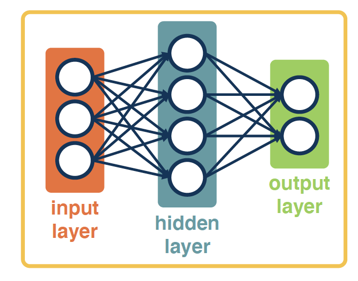

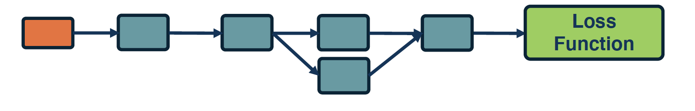

## Convolutional Neural Networks

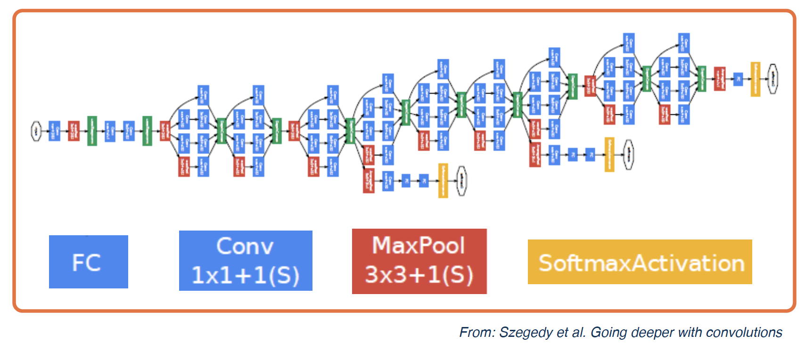

## Deep Learning = Hierarchical Compositionality

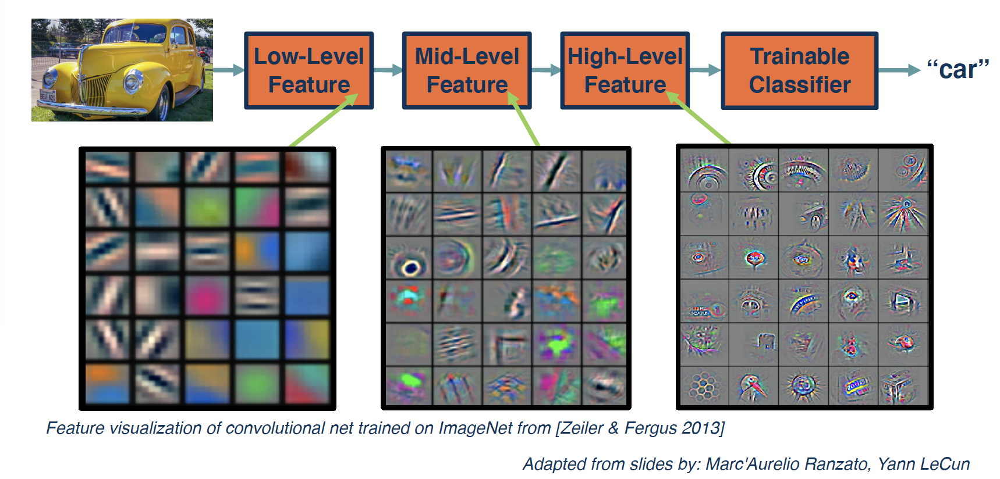

## Hierarchical Compositionality

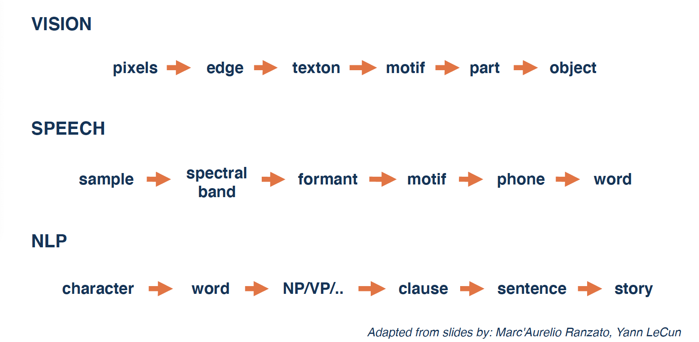

## Relationships are Important

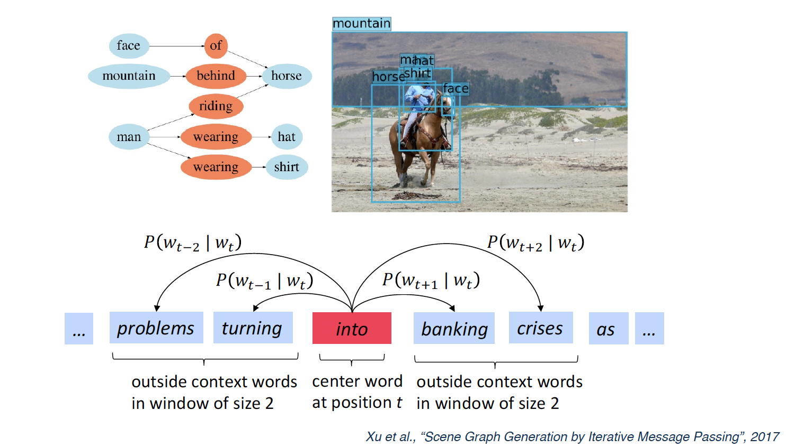

## Relationships are Everywhere

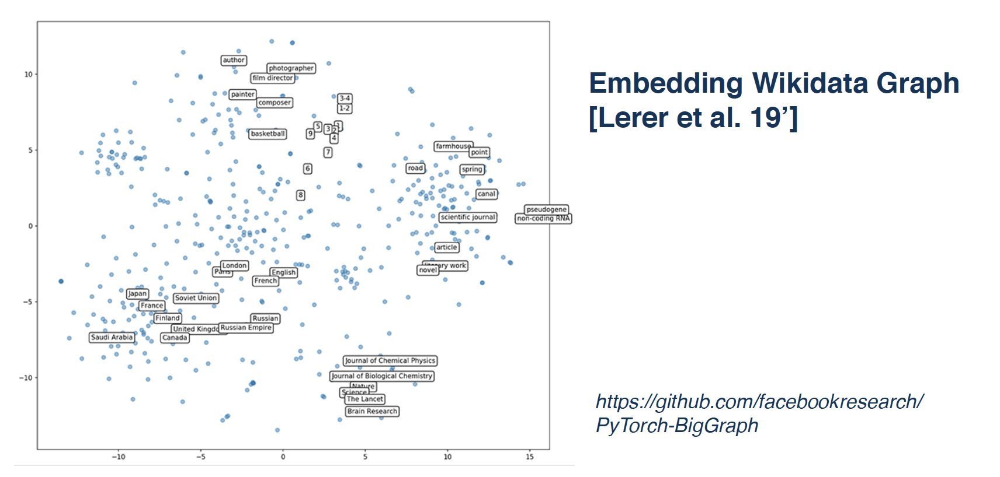

## The Space of Architectures

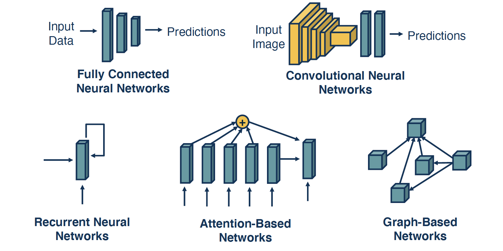

## Graph Embeddings

__Embedding:__ A learned map from entities to vectors of numbers that encodes similarity
- Word embeddings: word -> vector
- Graph embeddings: node -> vector

__Graph Embedding:__ Optimize the objective that __connected nodes have more similar embeddings__ than unconnected nodes via gradient descent.

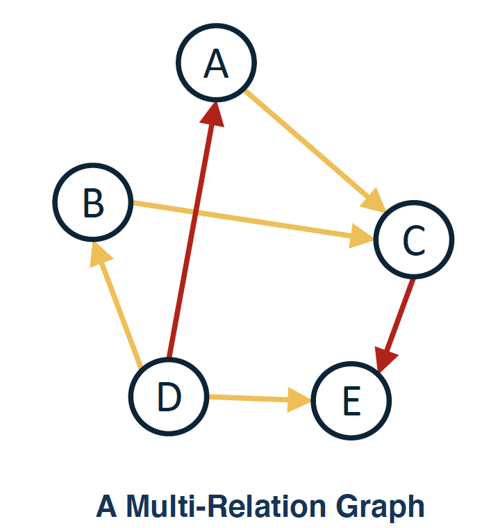

*More info in Q&A: __In the domain of deep learning, summarize key advances of graph embedding in the recent years. Provide references.__*

## Propagating Information

When representing structured information, several things are important:
- __State:__ Compactly representing all the data we have processed thus far
- __"Neighborhoods":__ What other elements to incorporate?
	- Can be seen as selecting from as set of elements
	- Typically done with some similarity measure or attention
- __Propagation of information:__ How to update information give nselected elemtns

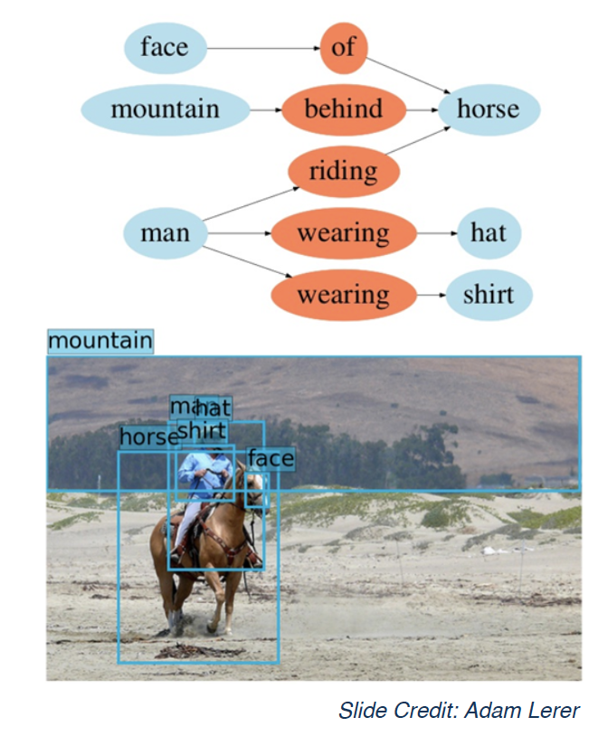

## Differentiably Selecting a Vector
- Given a set of vectors {__*u_1, ..., u_N*__} and a "query"
 vector __*q*__
 - We can select the most similar vector to __*q*__ via __*p = Softmax(Uq)*__

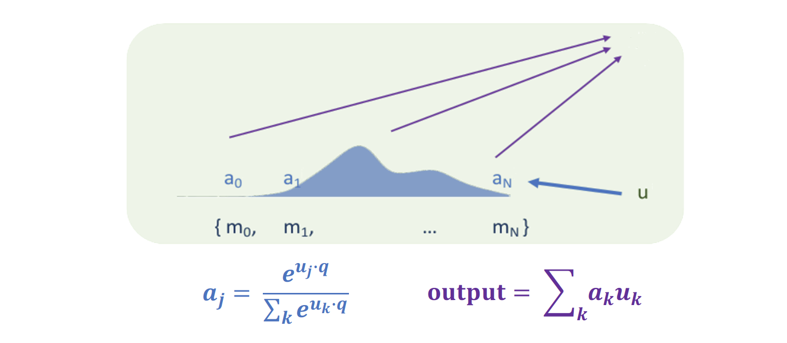

## Example: Non-Local Neural Networks

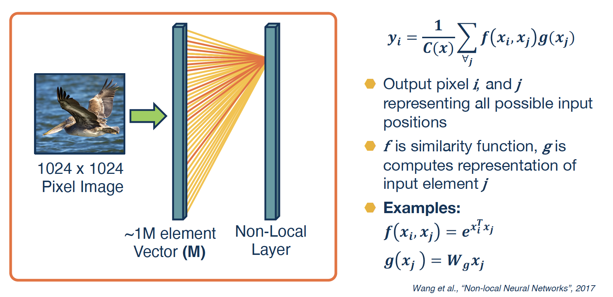

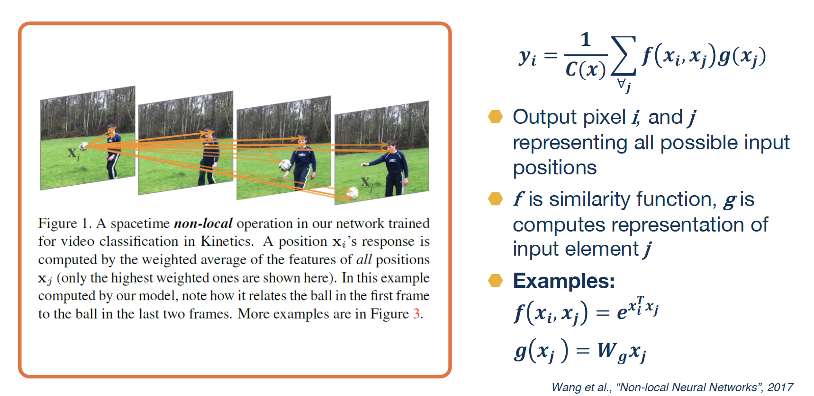

## References and Links:

- Szegedy et al. Going deeper with convolutions
- Zeiler & Fergus 2013
- Marc'Aurelio Ranzato, Yann LeCun
- Xu et al., “Scene Graph Generation by Iterative Message Passing”, 2017
- https://github.com/facebookresearch/PyTorch-BigGraphLinks
- Lerer et al. 19
- Adam Lerer
- Wang et al., “Non-local Neural Networks”, 2017