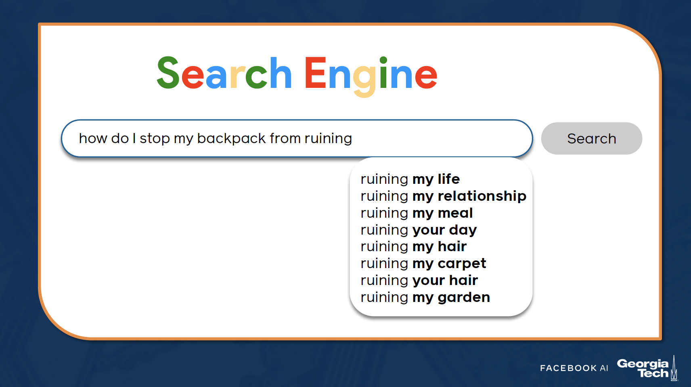

# Lesson 12: Language Models

## Language Modeling Part 1

Language models allow us to estimate probabilities of sequences such as:

```
p("I eat an apple")
```

### Modeling language as a Sequence

```
p(s) = p(w_1, w_2, ..., w_n)
```



### Applications of Language Modeling
__Predictive typing:__
- In search fields
- For keyboards
- For assisted typing, e.g. sentence completion

__Automatic speech recognition:__
- How likely is the user to have said *My hair is wet vs My hair is sweat*?

__Basic grammar correction:__
- p(*They're happy together*) > p(*Their happy together*)


