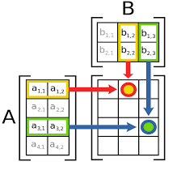
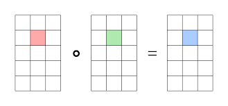
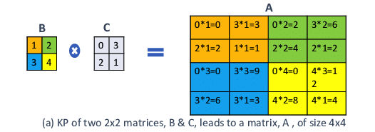
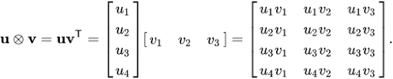
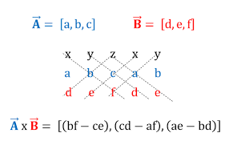
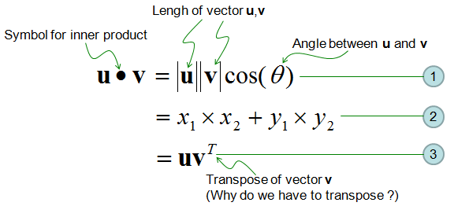

# Math Q&A

## 1. Does multiplication associative law apply to matrix multiplication?
Yes, the associative law does apply to matrix multiplication. The associative law states that for any three matrices A, B, and C, the following relationship holds:  
   
```  
(A * B) * C = A * (B * C)  
```  
   
Matrix multiplication is associative, meaning that you can group the matrices in any order when performing multiplication without changing the result, as long as the dimensions of the matrices are compatible for multiplication. Note that this does not imply commutativity, as the order of matrices still matters:  
   
```  
A * B ≠ B * A  (in general)  
```  
   
Matrix multiplication is generally *not commutative*, meaning that changing the order of the matrices can result in different products. However, the associative property allows you to regroup matrices during multiplication without affecting the result.


## 2. What are types of matrix products? For instance Hadamard product, Dot product, etc.
There are several types of matrix products, each serving different purposes and having different properties. Some of the most common matrix products include:  
   
1. **Matrix Multiplication (Dot Product)**: This is the standard matrix product where the elements of the rows of the first matrix are multiplied by the corresponding elements of the columns of the second matrix and then summed to produce the resulting matrix. Matrix multiplication is associative but not commutative.  

 <br>
*[From: Introduction to Matrices and Matrix Arithmetic for Machine Learning](https://machinelearningmastery.com/introduction-matrices-machine-learning/)*
   
2. **Hadamard Product (Element-wise Product)**: Also known as the Schur product, this product multiplies each element of the first matrix by the corresponding element of the second matrix. The Hadamard product is commutative and associative.  

 <br>
*[From: Wikimedia Commons](https://commons.wikimedia.org/wiki/File:Hadamard_product_qtl2.svg)*

3. **Kronecker Product**: The Kronecker product, also known as the tensor product, is an operation that takes two matrices A (of dimensions m x n) and B (of dimensions p x q) and produces a new matrix C (of dimensions m*p x n*q) by multiplying each element of A with the entire matrix B. The Kronecker product is associative but not commutative.  

 <br>
*[From: Compressing Language Models using Doped Kronecker Products](https://arxiv.org/abs/2001.08896)*

4. **Outer Product**: The outer product is an operation that takes two vectors (one-dimensional matrices) A (of dimensions m x 1) and B (of dimensions n x 1) and produces a new matrix C (of dimensions m x n) by multiplying each element of A with each element of B. The outer product is not commutative.  

 <br>
*[From: Wikipedia](https://en.wikipedia.org/wiki/Outer_product)*
  
5. **Cross Product**: The cross product is an operation that takes two 3-dimensional vectors and produces a new 3-dimensional vector perpendicular to the plane formed by the two input vectors. The cross product is not commutative and is only applicable to 3-dimensional vectors.  

 <br>
*[From: Mechanics Map](http://mechanicsmap.psu.edu/websites/A1_vector_math/A1-4_crossproduct/crossproduct.html)*

6. **Inner Product (Dot Product for Vectors)**: The inner product is an operation that takes two vectors A and B of the same length and produces a scalar value as the result. It is calculated as the sum of the products of corresponding elements in the two vectors. The inner product is commutative and is a special case of the matrix multiplication when both matrices are one-dimensional.  

 <br>
*[From: ShareTechnote](https://www.sharetechnote.com/html/Handbook_EngMath_Matrix_InnerProduct.html)*
   
These are some of the most common matrix products, each with different properties and applications in various fields such as linear algebra, computer graphics, and machine learning.

## 3. What is element wise matrix multiplication called?
Element-wise matrix multiplication is called the Hadamard product or Schur product. In this operation, each element of the first matrix is multiplied by the corresponding element of the second matrix, resulting in a new matrix with the same dimensions as the input matrices.  
   
For example, given two matrices A and B:  
   
```  
A = | a11 a12 |  
    | a21 a22 |  
   
B = | b11 b12 |  
    | b21 b22 |  
```  
   
The Hadamard product (denoted by the symbol ⊙) is computed as follows:  
   
```  
A ⊙ B = | a11 * b11  a12 * b12 |  
        | a21 * b21  a22 * b22 |  
```  
   
In Python, you can perform element-wise matrix multiplication using NumPy:  
   
```python  
import numpy as np  
   
A = np.array([[1, 2], [3, 4]])  
B = np.array([[5, 6], [7, 8]])  
   
# Hadamard product  
C = A * B  
```  
   
The Hadamard product is different from the matrix multiplication (dot product), where the elements of the rows of the first matrix are multiplied by the corresponding elements of the columns of the second matrix and then summed to produce the resulting matrix.